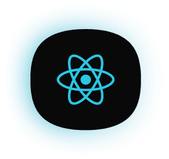
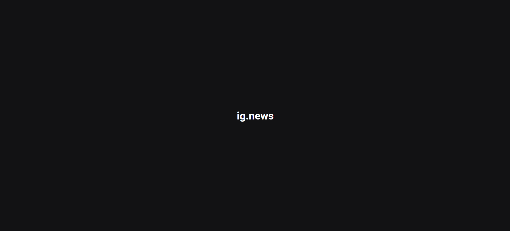

<h1 align="center">
  
</h1>

<h3 align="center">
  ig.news
</h3>

<p align="center">Aplicação para leitura de publicações de newsletter utilizando Next.js</p>

<p align="center">
  <a href="#como-executar-o-projeto">Como executar o projeto</a>&nbsp;&nbsp;&nbsp;|&nbsp;&nbsp;&nbsp;
  <a href="#anotações">Anotações</a>
</p>

<p align="center">Front-end</p>

<p align="center">
  
</p>

## Como executar o projeto

### Clonar este repositório

```bash
git clone https://github.com/eliasmcastro/rocketseat-ignite-reactjs-ig-news.git
```

### Requisitos

- [Node.js](https://nodejs.org) na versão 16.14.0
- [Yarn](https://yarnpkg.com) na versão 1.22.5

### Passos para a execução

**1. Executar aplicação**

Instalar as dependências do projeto

```bash
yarn
```

Iniciar a aplicação

```bash
yarn dev
```

A aplicação começará a ser executada em http://localhost:3000

## Anotações

### Criação do projeto

- `yarn create next-app ignews` cria um projeto next utilizando o [create next-app](https://nextjs.org/)

### TypeScript

- `yarn add typescript @types/react @types/node -D` para instalar o typescript e tipagens do react e node

### SASS

- `yarn add sass` para instalar o SASS